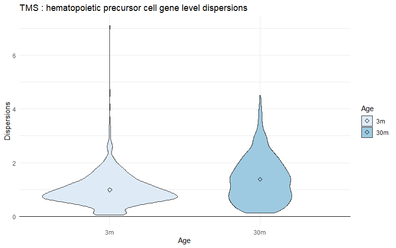
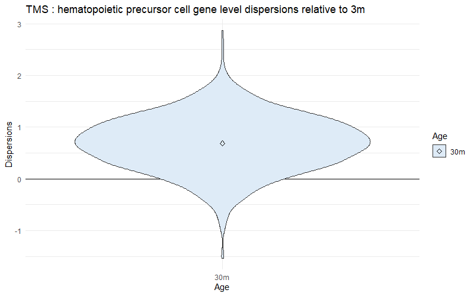

```{r, include = FALSE}
knitr::opts_chunk$set(
  collapse = TRUE,
  comment = "#>"
)
```

## Vignette Info
This vignette describes a few possible downstream analysis options for INClock outputs. Before proceeding with this vignette, you should consider working through Vignette 1 first to obtain the list of dispersion parameters. This Vignette assumes that you have obtained dispersion parameters from the neighbor-smoothing based manifold. Note that if you performed data subsetting in Vignette 1, the results from these downstream analyses may not be representative of findings from our paper, but feel free to replace the `tms_marrow_dispersions` object with the dispersion parameters estimated over the entire matrix.

## Analysis 1: Violin plots for cell type specific dispersion parameter distributions

```{r eval=FALSE}
# Check the summary statistics
for (name in names(tms_marrow_dispersions)) {
  message(paste0("Summary statistics for ", name))
  print(summary(tms_marrow_dispersions[[name]]))
}

# Generate violin plots to compare dispersion parameters across ages for each cell type
# install.packages("ggplot2")
library(ggplot2)

for (name in names(tms_marrow_dispersions)) {
  # Create temporary dataframes for plotting
  disp_df <- tms_marrow_dispersions[[name]]
  if (ncol(disp_df) > 1) {
    Age <- vector()
    Dispersions <- vector()
    for (i in seq(2, ncol(disp_df))) {
      Age <- append(Age, rep(colnames(disp_df)[i], nrow(disp_df)))
      Dispersions <- append(Dispersions, disp_df[, i])
    }
    Age <- factor(Age, levels = colnames(disp_df)[seq(2, ncol(disp_df))])
  }
  temp <- data.frame(Age, Dispersions)

  # Create violin plots
  p <- ggplot(temp, aes(x = Age, y = Dispersions, fill = Age)) +
    geom_hline(aes(yintercept = 0)) +
    geom_violin(trim = TRUE) +
    stat_summary(fun = mean, geom = "point", shape = 23, size = 2) +
    scale_fill_brewer(palette = "Blues") +
    theme_minimal() +
    ggtitle(paste0("TMS ", ": ", name, " gene level dispersions"))

  # Save the plots as pdf files (optional)
  pdf(file = paste0("file_path_of_your_choice", "/TMS_", "estimated_dispersion_", gsub(" ", "_", name), ".pdf")) # Replace with your own file path
  print(p)
  dev.off()
}

# Alternative: Generate violin plots for log-fold changes of dispersion parameters with respect to the youngest age group
# You need at least two age groups to start with
for (name in names(tms_marrow_dispersions)) {
  # Create temporary dataframes for plotting
  disp_df <- tms_marrow_dispersions[[name]]
  if (ncol(disp_df) > 2) {
    Age <- vector()
    Dispersions <- vector()
    for (i in seq(3, ncol(disp_df))) {
      Age <- append(Age, rep(colnames(disp_df)[i], nrow(disp_df)))
      Dispersions <- append(Dispersions, log2(disp_df[, i] / disp_df[, 2]))
    }
    Age <- factor(Age, levels = colnames(disp_df)[seq(3, ncol(disp_df))])
  }
  temp <- data.frame(Age, Dispersions)

  # Create violin plots
  p <- ggplot(temp, aes(x = Age, y = Dispersions, fill = Age)) +
    geom_hline(aes(yintercept = 0)) +
    geom_violin(trim = TRUE) +
    stat_summary(fun = mean, geom = "point", shape = 23, size = 2) +
    scale_fill_brewer(palette = "Blues") +
    theme_minimal() +
    ggtitle(paste0("TMS ", ": ", name, " gene level dispersions relative to ", colnames(disp_df)[2]))

  # Save the plots as pdf files (optional)
  pdf(file = paste0("file_path_of_your_choice", "/TMS_", "estimated_dispersion_", gsub(" ", "_", name), ".pdf")) # Replace with your own file path
  print(p)
  dev.off()
}
```

Below, we showcase two examples of the violin plots following our previous codes.

```{r, out.width='80%', fig.cap="Example 1: violin plot for gene level dispersions", echo=FALSE}

```

```{r, out.width='80%', fig.cap="Example 2: violin plot for log-fold changes", echo=FALSE}

```

## Analysis 2: Pathway enrichment analysis for dispersed genes
