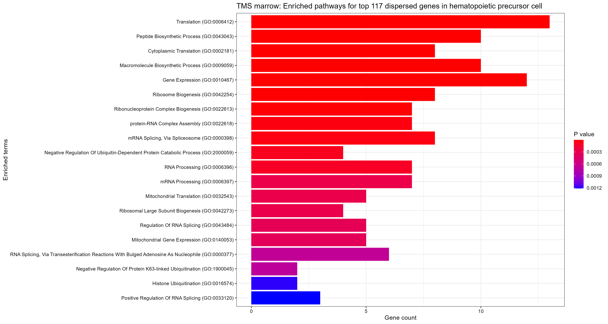

```{r, include = FALSE}
knitr::opts_chunk$set(
  collapse = TRUE,
  comment = "#>"
)
```

## Vignette Info
This vignette describes a few possible downstream analysis options for INClock outputs. Before proceeding with this vignette, you should consider working through Vignette 1 first to obtain the list of dispersion parameters. This vignette assumes that you have obtained dispersion parameters from the neighbor-smoothing based manifold. 

Note that if you performed data subsetting in Vignette 1, the results from these downstream analyses may not be representative of the findings from our paper, but feel free to replace the `tms_marrow_dispersions` object with the dispersion parameters estimated over the entire matrix.

## Analysis 1: Violin plots for cell type specific dispersion parameter distributions

The very first downstream analysis we can perform is to create violin plots displaying distributions of dispersion parameters across different ages groups for each cell type. Two variations of violin plots are described: one for comparing the raw dispersion parameter values and the other one for comparing log-fold changes of dispersion parameters of the older age groups with respect to the youngest.

```{r eval=FALSE}
# Check the summary statistics
for (name in names(tms_marrow_dispersions)) {
  message(paste0("Summary statistics for ", name))
  print(summary(tms_marrow_dispersions[[name]]))
}

# Generate violin plots to compare dispersion parameters across ages for each cell type
# install.packages("ggplot2")
library(ggplot2)

for (name in names(tms_marrow_dispersions)) {
  # Create temporary dataframes for plotting
  disp_df <- tms_marrow_dispersions[[name]]
  if (ncol(disp_df) > 1) {
    Age <- vector()
    Dispersions <- vector()
    for (i in seq(2, ncol(disp_df))) {
      Age <- append(Age, rep(colnames(disp_df)[i], nrow(disp_df)))
      Dispersions <- append(Dispersions, disp_df[, i])
    }
    Age <- factor(Age, levels = colnames(disp_df)[seq(2, ncol(disp_df))])
  }
  temp <- data.frame(Age, Dispersions)

  # Create violin plots
  p <- ggplot(temp, aes(x = Age, y = Dispersions, fill = Age)) +
    geom_hline(aes(yintercept = 0)) +
    geom_violin(trim = TRUE) +
    stat_summary(fun = mean, geom = "point", shape = 23, size = 2) +
    scale_fill_brewer(palette = "Blues") +
    theme_minimal() +
    ggtitle(paste0("TMS ", ": ", name, " gene level dispersions"))

  # Save the plots as pdf files (optional)
  pdf(file = paste0("file_path_of_your_choice", "/TMS_marrow_estimated_dispersion_", gsub(" ", "_", name), ".pdf")) # Replace with your own file path
  print(p)
  dev.off()
}

# Alternative: Generate violin plots for log-fold changes of dispersion parameters with respect to the youngest age group
# You need at least two age groups to start with
for (name in names(tms_marrow_dispersions)) {
  # Create temporary dataframes for plotting
  disp_df <- tms_marrow_dispersions[[name]]
  if (ncol(disp_df) > 2) {
    Age <- vector()
    Dispersions <- vector()
    for (i in seq(3, ncol(disp_df))) {
      Age <- append(Age, rep(colnames(disp_df)[i], nrow(disp_df)))
      Dispersions <- append(Dispersions, log2(disp_df[, i] / disp_df[, 2]))
    }
    Age <- factor(Age, levels = colnames(disp_df)[seq(3, ncol(disp_df))])
  }
  temp <- data.frame(Age, Dispersions)

  # Create violin plots
  p <- ggplot(temp, aes(x = Age, y = Dispersions, fill = Age)) +
    geom_hline(aes(yintercept = 0)) +
    geom_violin(trim = TRUE) +
    stat_summary(fun = mean, geom = "point", shape = 23, size = 2) +
    scale_fill_brewer(palette = "Blues") +
    theme_minimal() +
    ggtitle(paste0("TMS ", ": ", name, " gene level dispersions relative to ", colnames(disp_df)[2]))

  # Save the plots as pdf files (optional)
  pdf(file = paste0("file_path_of_your_choice", "/TMS_marrow_estimated_dispersion_change", gsub(" ", "_", name), ".pdf")) # Replace with your own file path
  print(p)
  dev.off()
}
```

Below, we showcase two examples of the violin plots following our previous codes.

```{r, out.width='80%', fig.cap="Example 1: violin plot for gene level dispersions", fig.align='center', echo=FALSE}
knitr::include_graphics("figures/dispersion_plot_example.png")
```

```{r, out.width='80%', fig.cap="Example 2: violin plot for log-fold changes", fig.align='center', echo=FALSE}
knitr::include_graphics("figures/log_fold_change_plot_example.png")
```

## Analysis 2: Pathway enrichment analysis for dispersed genes

Through the identification of significantly enriched pathways, we are able to understand the roles of genes that contribute the most to the dispersion parameter changes. In this analysis, we use `enrichR` package to perform GO term and KEGG pathway enrichment analysis.

One important component of this analysis is to properly define the concept of dispersed genes for a specific cell type. For this vignette, we calculate a measure of dispersion score for genes in every cell type as the following: 
$$
\text{Disp Score}_g = \frac{1}{N_{\text{Age Group}}}\sum_{i\in\text{Old Age Groups}}\log\left(\frac{\phi_g^i}{\phi_g^{\text{Youngest Age Group}}}\right)
$$
where $\phi_g$ stands for the dispersion parameter of a gene $g$. 

Specifically in the Tabular Muris Senis data, we select the old age groups as the 21 months, 24 months, and 30 months old mice, and the youngest age group as whichever youngest age group available for a cell type (usually 1 or 3 months). As our subsetted dataset only contain 3 months and 30 months old mice, the dispersion score will simply be the log-fold change of the 30 months old mice over the 3 months old ones. For your own analysis, feel free to revise how the dispersion scores are calculated. Then, we order genes by their dispersion scores and select the top 10% for pathway enrichment analysis.

```{r eval=FALSE}
# install.packages("enrichR")
# install.packages("dplyr")
# install.packages("ggplot2")
library(enrichR)
library(dplyr)
library(ggplot2)

# Perform pathway enrichment analysis over top dispersed genes
for (name in names(tms_marrow_dispersions)) {
  # Create temporary dataframes for the analysis
  disp_df <- tms_marrow_dispersions[[name]]
  if (ncol(disp_df) > 2) {
    Age <- vector()
    Gene <- vector()
    Dispersions <- vector()
    for (i in seq(3, ncol(disp_df))) {
      Age <- append(Age, rep(colnames(disp_df)[i], nrow(disp_df)))
      Gene <- append(Gene, rownames(tms_marrow_manifold_neighbor))
      Dispersions <- append(Dispersions, log2(disp_df[, i] / disp_df[, 2]))
    }
    Age <- factor(Age, levels = colnames(disp_df)[seq(3, ncol(disp_df))])
  }
  temp <- data.frame(Age, Gene, Dispersions)
  temp <- temp[!is.infinite(temp$Dispersions) & !is.na(temp$Dispersions), ]
  temp <- temp[temp$Age %in% c("21m", "24m", "30m"), ]
  disp.scores <- aggregate(
    x = temp$Dispersions,
    by = list(temp$Gene),
    FUN = mean
  ) %>% arrange(desc(x))
  colnames(disp.scores) <- c("Gene", "Dispersion_score")

  # Save the tables of dispersion scores by genes
  write.csv(disp.scores, paste0("file_path_of_your_choice", "/TMS_marrow_dispersed_genes_", gsub(" ", "_", name), ".csv"))

  # Take top 10% genes (with positive log-fold changes)
  message(paste0(nrow(disp.scores[disp.scores$Dispersion_score >= 0, ]), " out of ", nrow(disp.scores), " have positive dispersion scores"))
  disp.scores <- disp.scores %>% filter(row_number() < nrow(disp.scores) * 0.1)
  disp.scores <- disp.scores[disp.scores$Dispersion_score >= 0, ]
  sig.genes <- disp.scores$Gene
  message(paste0(length(sig.genes), " top dispersed genes are kept"))

  # Pathway enrichment
  enrich_results <- enrichr(genes = sig.genes, databases = c("GO_Biological_Process_2023", "KEGG_2019_Mouse"))[[1]]

  # Create and save plots showing top enriched pathways
  p <- plotEnrich(enrich_results,
    showTerms = 20, numChar = 100, y = "Count", orderBy = "P.value",
    title = paste0("TMS marrow: Enriched pathways for top ", length(sig.genes), " dispersed genes in ", name)
  )
  ggsave(paste0("file_path_of_your_choice", "/TMS_marrow_pathway_enrichment_", gsub(" ", "_", name), ".pdf"), plot = p, width = 15, height = 8)
}
```

There, you have acquired enriched pathways for genes with high dispersion parameter changes across age groups. Similarly, we also show an example of the enriched pathway plot below.

```{r, out.width='80%', fig.cap="Example 3: top enriched pathways", fig.align='center', echo=FALSE}

```
